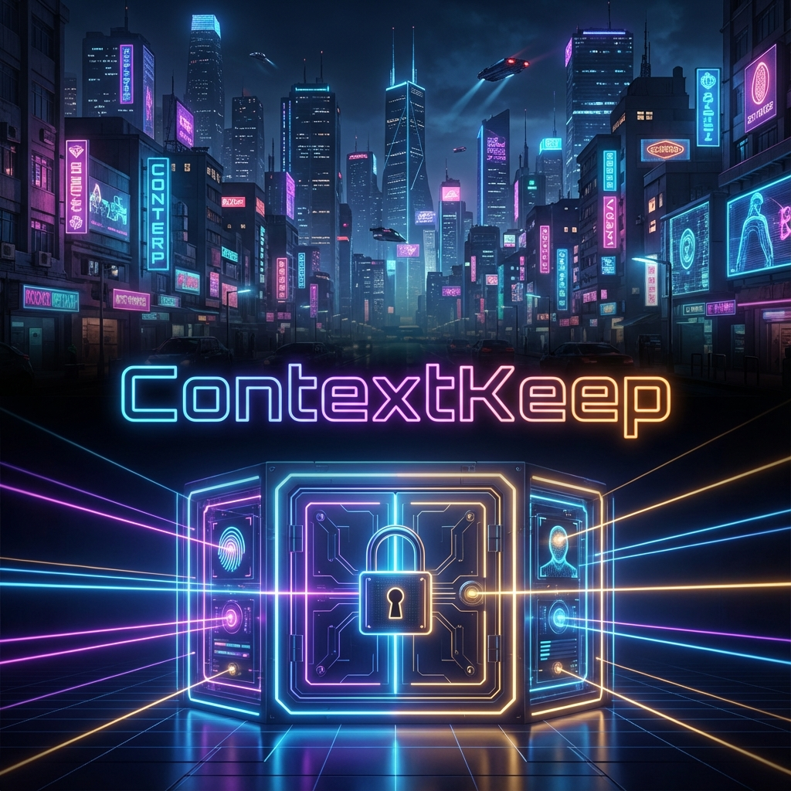

<div align="center">



# ContextKeep 🧠
### Infinite Long-Term Memory for AI Agents

[](https://github.com/mordang7/ContextKeep)
[](https://github.com/mordang7/ContextKeep)
[](https://github.com/mordang7/ContextKeep)
[](https://opensource.org/licenses/MIT)
[](https://www.python.org/downloads/)
[](https://modelcontextprotocol.io/)
[](https://docs.docker.com/)
[](https://www.paypal.com/paypalme/GeekJohn)

**ContextKeep** is a powerful, standalone memory server that gives your AI agents (Claude, Cursor, Gemini, OpenCode, and more) a persistent, searchable brain. Stop repeating yourself — let your AI remember everything, permanently.

[Features](#-features) • [What's New in V1.3](#-whats-new-in-v13---harbor) • [Installation](#-installation) • [MCP Tools](#-mcp-tools) • [Web Dashboard](#-web-dashboard) • [Configuration](#-configuration)

</div>

---

## 🌟 Features

*   **♾️ Infinite Context:** Store unlimited project details, preferences, decisions, and snippets — no expiry, no size cap.
*   **💰 Save Money & Tokens:** Pull only the memories that matter, slashing context window usage and API costs.
*   **🔌 Universal Compatibility:** Works with *any* MCP-compliant client via Stdio (local) or SSE (remote/homelab).
*   **🧭 Memory Index Protocol:** A reliable two-step retrieval system — `list_all_memories()` → `retrieve_memory()` — so agents always find the right key, every time.
*   **🖥️ Modern Web Dashboard:** Manage your memories visually with Grid, List, and Calendar views in a sleek dark interface.
*   **🔒 Privacy First:** 100% local storage. Your data never touches an external server.
*   **🔎 Smart Search:** Keyword and semantic search across all memory content.
*   **🐧 Linux Service:** Runs silently in the background as a systemd service.
*   **🐳 Docker Ready:** One-command deployment with Docker Compose.
*   **⬇️ Export & Backup:** Export all memories as JSON via MCP tool or WebUI.

---


---

## 🆕 What's New in V1.3 — Harbor

### 🐳 Docker Support
The #1 community request. ContextKeep now ships with a `Dockerfile` and `docker-compose.yml` for one-command deployment:

```bash
docker compose up --build
```

That's it. MCP server on `:5100`, WebUI on `:5000`, with persistent storage via Docker volumes.

### 📦 Modern Python Packaging
- **`pyproject.toml`** — canonical dependency spec for `uv`, `poetry`, or `pip`
- **`uv` support** — the installer auto-detects `uv` and uses `uv sync` for blazing-fast setup
- **Backwards compatible** — `pip install -r requirements.txt` still works

### 🛠️ 3 New MCP Tools (5 → 8 total)

| New Tool | Purpose |
|----------|---------|
| `delete_memory(key)` | Agents can now delete memories directly |
| `get_memory_stats()` | Memory count, total chars, storage path at a glance |
| `export_memories()` | Full backup as JSON — for migration or archival |

### ⬇️ WebUI Export
- **Export All** button in the toolbar (or press `Ctrl+E`)
- Downloads a timestamped `contextkeep_backup_YYYY-MM-DD.json`

### 🧹 Code Quality
- Fixed dead code in `memory_manager.py` (unreachable duplicate `try/except`)
- Added missing `core/__init__.py` for proper Python packaging
- Replaced bare `except:` with `except Exception:` throughout

---

## 🚀 Installation

### Option 1: Quick Start (pip)

1.  **Clone the repository:**
    ```bash
    git clone https://github.com/mordang7/ContextKeep.git
    cd ContextKeep
    ```

2.  **Run the Installer:**
    *   **Linux/macOS:**
        ```bash
        python3 install.py
        ```
    *   **Windows:**
        ```powershell
        python install.py
        ```

3.  **Follow the Wizard:** The installer creates a virtual environment, installs dependencies, and generates a ready-to-use `mcp_config.json`.

### Option 2: uv (Fast)

```bash
git clone https://github.com/mordang7/ContextKeep.git
cd ContextKeep
uv sync
uv run python server.py
```

### Option 3: Docker (Recommended for Homelabs)

```bash
git clone https://github.com/mordang7/ContextKeep.git
cd ContextKeep
docker compose up --build -d
```

This starts:
| Service | Port | Purpose |
|---------|------|---------|
| `mcp-server` | `5100` | MCP server (SSE transport) |
| `webui` | `5000` | Web dashboard |

Memories persist in a Docker volume (`contextkeep-data`).

---

## 🛠️ MCP Tools

ContextKeep exposes **8 MCP tools** to any connected agent:

| Tool | Signature | Purpose |
|------|-----------|---------| 
| `list_all_memories` | *(no args)* | **[USE FIRST]** Returns a full directory of all memory keys, titles, tags, and timestamps |
| `retrieve_memory` | `(key: str)` | Fetch the full content of a specific memory by exact key |
| `store_memory` | `(key: str, content: str, tags: str)` | Create or update a memory |
| `search_memories` | `(query: str)` | Content-based keyword/semantic search across all memories |
| `list_recent_memories` | *(no args)* | Return the 10 most recently updated memories |
| `delete_memory` | `(key: str)` | Delete a memory permanently by key |
| `get_memory_stats` | *(no args)* | Get total memory count, character count, and storage path |
| `export_memories` | *(no args)* | Export all memories as a JSON array |

### Recommended Agent Directive

Add this to your `GEMINI.md`, `AGENTS.md`, or `CLAUDE.md`:

```markdown
## Memory Index Protocol (MANDATORY)
1. FIRST — call `list_all_memories()` to get the complete key directory
2. THEN — call `retrieve_memory(exact_key)` using the exact key from step 1
Only use `search_memories()` for content-based searches, NOT for key lookup.
```

---

## 🔌 Configuration

Copy the contents of `mcp_config.example.json` into your AI client's config file and update the paths.

### Option 1: Local (Claude Desktop / Gemini CLI / Cursor)
```json
{
  "mcpServers": {
    "context-keep": {
      "command": "/absolute/path/to/ContextKeep/venv/bin/python",
      "args": ["/absolute/path/to/ContextKeep/server.py"]
    }
  }
}
```

### Option 2: Remote via SSH (Homelab / Raspberry Pi)
Run ContextKeep on a home server and access it from any machine on your network:
```json
{
  "mcpServers": {
    "context-keep": {
      "command": "ssh",
      "args": [
        "-i", "/path/to/private_key",
        "user@192.168.1.X",
        "'/path/to/ContextKeep/venv/bin/python'",
        "'/path/to/ContextKeep/server.py'"
      ]
    }
  }
}
```

### Option 3: SSE Mode (HTTP)
Ideal for OpenCode, web apps, or any client that prefers HTTP transport:
```json
{
  "mcpServers": {
    "context-keep": {
      "transport": "sse",
      "url": "http://localhost:5100/sse"
    }
  }
}
```

### Option 4: Docker
Use `mcp_config.docker.example.json` or point your client to the container:
```json
{
  "mcpServers": {
    "context-keep": {
      "transport": "sse",
      "url": "http://localhost:5100/sse"
    }
  }
}
```

---

## 🌐 Web Dashboard

ContextKeep ships with a full-featured web UI to manage your memories without touching the CLI.

*   **URL:** `http://localhost:5000`
*   **Grid View:** Memory cards with tag chips, char counts, and inline actions
*   **List View:** Dense, scannable table with all memories sorted by last updated
*   **Calendar View:** Browse your memory history by month
*   **Search:** Real-time filtering across titles, keys, and content
*   **Full CRUD:** Create, view, edit, and delete memories from the browser
*   **Export:** Download all memories as JSON with one click (`Ctrl+E`)

**To start manually:**
```bash
./venv/bin/python webui.py
```

---

## 🐧 Linux Service Setup (Recommended for Homelabs)

Run both the MCP server and Web UI as persistent background services:

```bash
chmod +x install_services.sh
./install_services.sh
```

This installs:

| Service | Port | Purpose |
|---------|------|---------|
| `contextkeep-server` | `5100` | MCP server (SSE transport) |
| `contextkeep-webui` | `5000` | Web dashboard |

**Manage services:**
```bash
sudo systemctl status contextkeep-server
sudo systemctl restart contextkeep-webui
```

---

## 📋 Changelog

### V1.3 — Harbor
- ✅ **Docker Support** — Dockerfile + docker-compose.yml for one-command deployment
- ✅ **Modern Packaging** — `pyproject.toml` + `uv` support alongside pip
- ✅ New MCP tool: `delete_memory()` — agents can now delete memories
- ✅ New MCP tool: `get_memory_stats()` — memory count & size at a glance
- ✅ New MCP tool: `export_memories()` — full backup as JSON
- ✅ WebUI: Export All button with `Ctrl+E` shortcut
- ✅ WebUI: Stats API endpoint
- ✅ Fix: Removed dead code in `memory_manager.py`
- ✅ Fix: Added missing `core/__init__.py` for Docker/package imports
- ✅ Fix: Bare `except` replaced with `except Exception`
- ✅ Updated installer to V1.3 with `uv` detection
- ✅ Community contributors credited 🙏

### V1.2 — Obsidian Lab
- ✅ New `list_all_memories()` MCP tool — complete memory directory in one call
- ✅ Obsidian Lab UI redesign — dark premium aesthetic with cyan/neon accents
- ✅ Memory count live badge in the header
- ✅ Calendar month navigation (forward/back)
- ✅ Grid cards now show tag chips and character count badges
- ✅ Removed "Recent Memories" sidebar for a cleaner calendar layout
- ✅ Memory Index Protocol V1.2 — standardised two-step agent retrieval pattern

### V1.1
- Web dashboard with Grid, List, and Calendar views
- SSE transport support alongside Stdio
- Linux systemd service installer
- Memory titles and timestamps

### V1.0
- Core MCP server with `store_memory`, `retrieve_memory`, `search_memories`
- JSON-backed persistent storage
- SSH remote transport support

---

## 🤝 Contributing

Contributions are welcome. Open a PR, file an issue, or suggest a feature — all input is appreciated.

### V1.3 Community Contributors

A huge thank you to everyone who contributed to the Harbor release:

- **[@shuft](https://github.com/shuft)** — Opened [Issue #1](https://github.com/mordang7/ContextKeep/issues/1) requesting Docker support
- **[@Cyberdogs7](https://github.com/Cyberdogs7)** — [PR #2](https://github.com/mordang7/ContextKeep/pull/2): Initial Docker & Docker Compose implementation
- **[@frehov](https://github.com/frehov)** — [PR #3](https://github.com/mordang7/ContextKeep/pull/3): Dockerfile, `pyproject.toml`, `uv` support, `__init__.py` fix
- **[@thinkstylestudio](https://github.com/thinkstylestudio)** — Community advocacy

## ☕ Support the Project

If ContextKeep saves you time, tokens, or sanity — consider buying me a coffee.

[](https://www.paypal.com/paypalme/GeekJohn)

---

<div align="center">
  <sub>Built with ❤️ by GeekJohn</sub>
</div>
